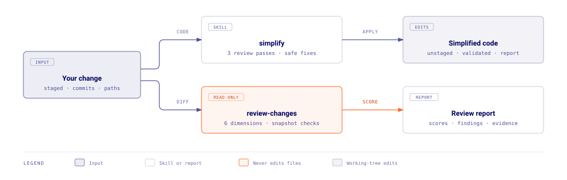

# Refactor Tools plugin

Refactor Tools packages safe cleanup that preserves behavior and review workflows for existing code.

## How it works



Each skill runs only when you invoke it directly.

### simplify

`simplify` applies safe simplifications to changed code.

- It targets named files, directories, commits, or ranges.
- It limits edits to the function, test, or block around each changed hunk unless you request a whole-file pass.
- It runs three review passes for code reuse, code quality, and efficiency.
- It applies safe findings with high confidence, or with medium confidence and targeted test coverage.
- It reports low-confidence, caution, and risky findings without applying them.
- It keeps its edits unstaged and preserves existing changes.
- It runs the narrowest relevant tests, type checks, and linters.

### review-changes

`review-changes` reviews changed code without editing it.

- It scores quality, security, simplicity, robustness, scalability, and maintainability from 1 to 10, each with confidence and coverage limits.
- It classifies each finding as a blocker, follow-up, or nit, with location, evidence, and fix.
- It checks the change against applicable `AGENTS.md`, `CLAUDE.md`, and similar guides, and against requirements you supply.
- It runs checks that may write files inside a temporary snapshot.
- It skips commands whose side effects it cannot bound.
- It reports executed checks, skipped checks with reasons, the negative control outcome, and remaining risk.

## Usage

```text
/refactor-tools:simplify
/refactor-tools:simplify src/components/ focus on duplication
/refactor-tools:review-changes
/refactor-tools:review-changes the change implements the attached task description
```

## Learn more

- `simplify` - see [the skill definition](./skills/simplify/SKILL.md)
- `review-changes` - see [the skill definition](./skills/review-changes/SKILL.md)

## Authors

[dhohner](https://github.com/dhohner)
